# Install DictTango on Android

This will help you to get DPD set up and configured in the DictTango app.

## About DictTango

DictTango uses MDict files, but offers a far better user experience than the MDict app itself.

- Open any word from a PDF or website by long-clicking and using the Android popup menu.

- Once inside the app, words can be navigated with a single-click.

- It also offers full text search as well as numerous other advanced features.

## Installation In Brief

1. Download the latest `dpd-mdict.zip` from the DPD releases page on [GitHub](https://github.com/digitalpalidictionary/dpd-db/releases/latest){:target="_blank"}

2. Download and install the latest version of DictTango from [GitHub](https://github.com/Jimex/DictTango-Android/releases/latest){:target="_blank"}

# Detailed Installation Instructions

Below are detailed *step-by-step* instructions. 

Please follow them *carefully* to get full DPD functionality. 

-- Download and install the latest version of DictTango from [GitHub](https://github.com/Jimex/DictTango-Android/releases/latest){:target="_blank"}

-- Download the latest **`dpd-mdict.zip`** from [GitHub](https://github.com/digitalpalidictionary/dpd-db/releases/latest){:target="_blank"}

-- Using your file-manager of choice, **unzip** `dpd-mdict.zip` 

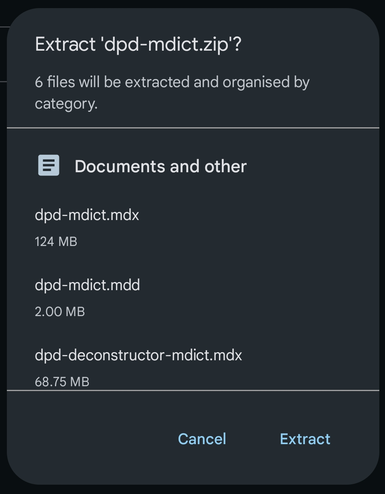

-- Open the DictTango app and click the **menu icon** in the top right-hand corner 

-- Click on **Dictionary List** 

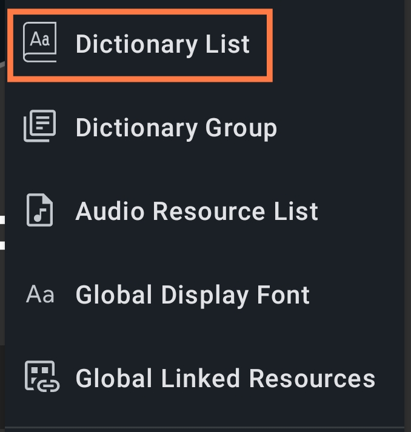

-- Click on the **menu icon** in the top right-hand corner of Dictionary List 

-- Click **Copy from SD Card** 

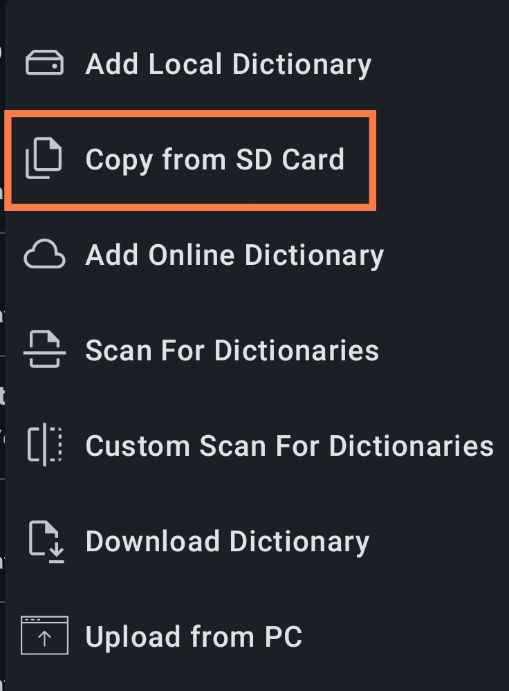

-- **Select** the 6 DPD files in your Android file browser 

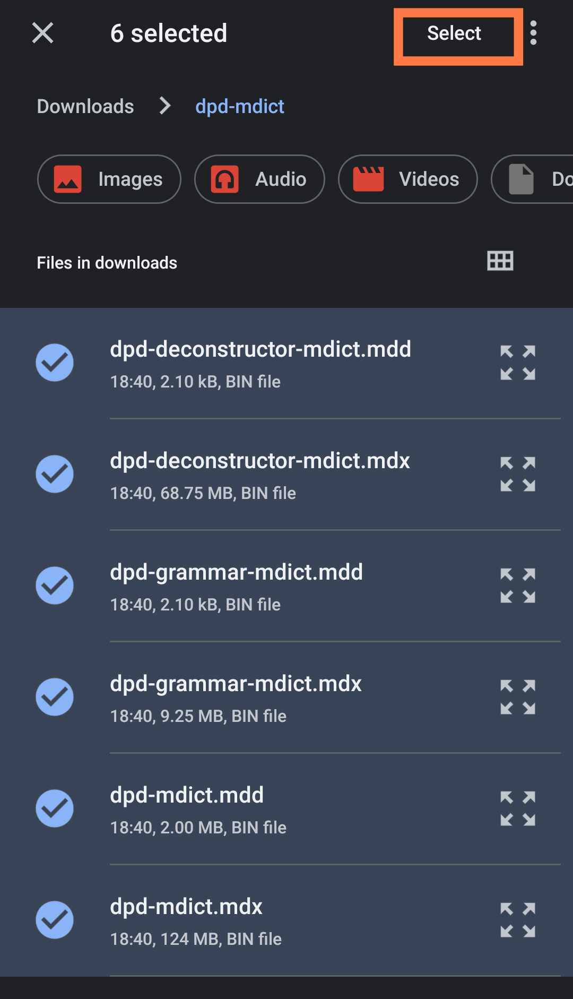

-- Select **Dictionaries Folder** as the destination folder 

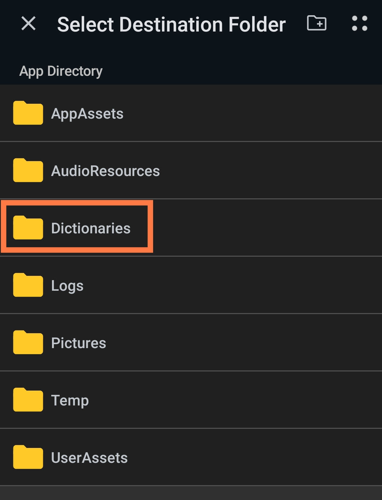

-- Click **Copy To Here** 

## Display All Entries

To see all DPD entries, follow the steps below. Otherwise, DictTango will only display the entry from the first dictionary it finds.

-- Click the **menu icon** in the top right-hand corner.

-- Select **Dictionary Group**. 

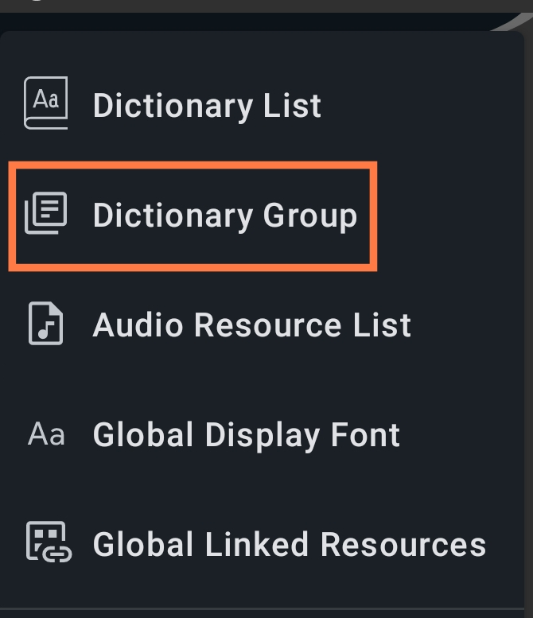

-- Select the **Default Group**.

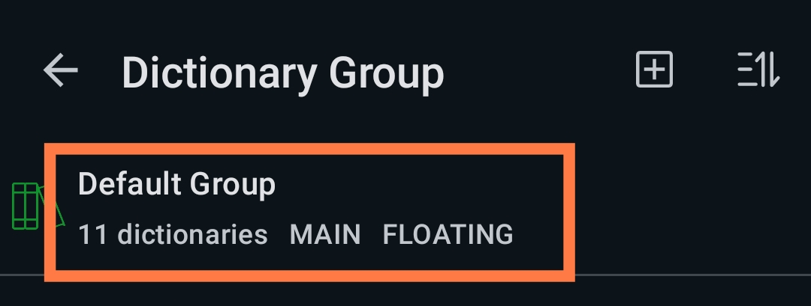

-- Click **Dictionaries**

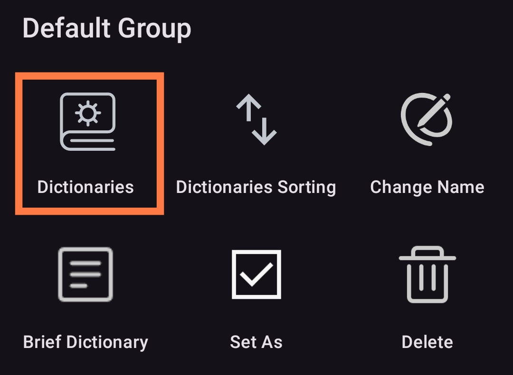

-- **Long press** to select any dictionary, then click **Select All** 

-- Click **More** in the bottom right-hand corner. 

-- Click on **Auto Expand** 

That's it. Now you'll see all entries from all dictionaries. 

## Change the Dictionary Order

While you are there, you can change the order in which dictionaries are displayed.

-- Click the **Sorting Mode Button** in the top right-hand corner 

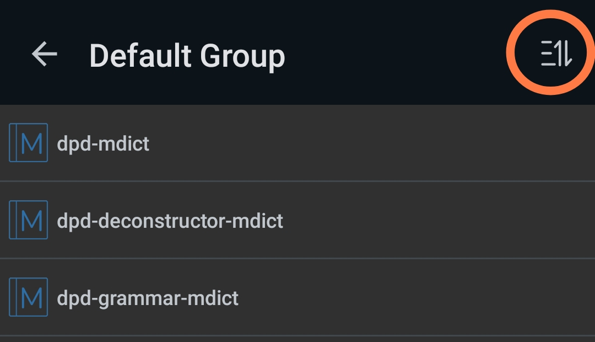

-- **Long click and drag**, or click the **arrows** to change the order of dictionaries. 

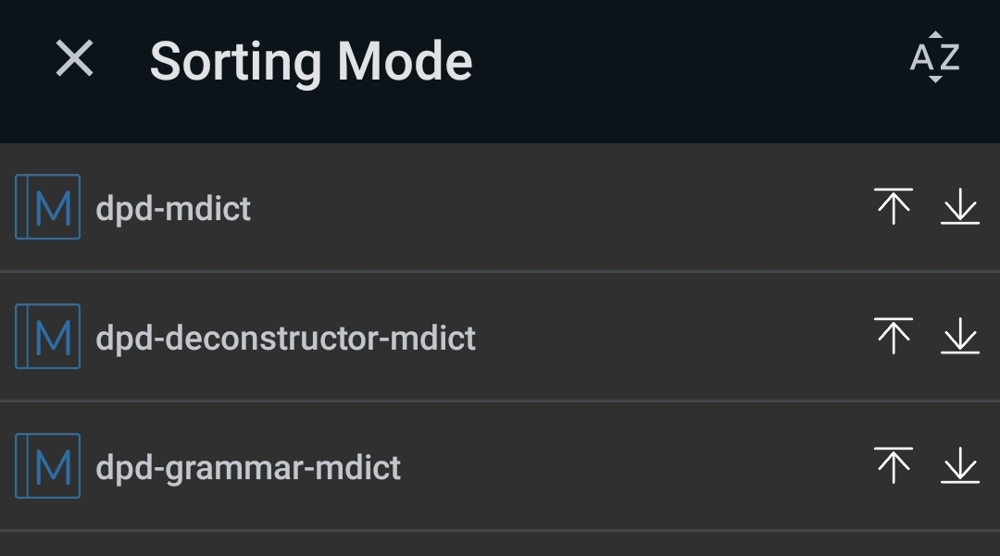

## Dark Mode

If you prefer dark mode, then

-- Click the **menu-icon** in the top right-hand corner. 

  

-- Click on **Settings** 

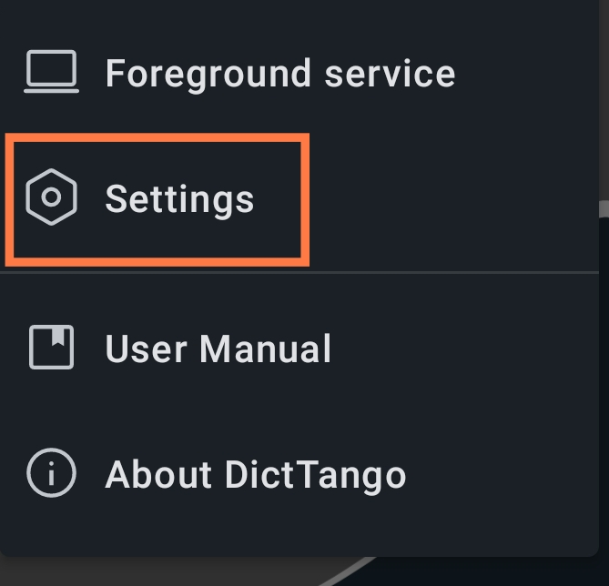

-- Choose your preferred dark mode. 

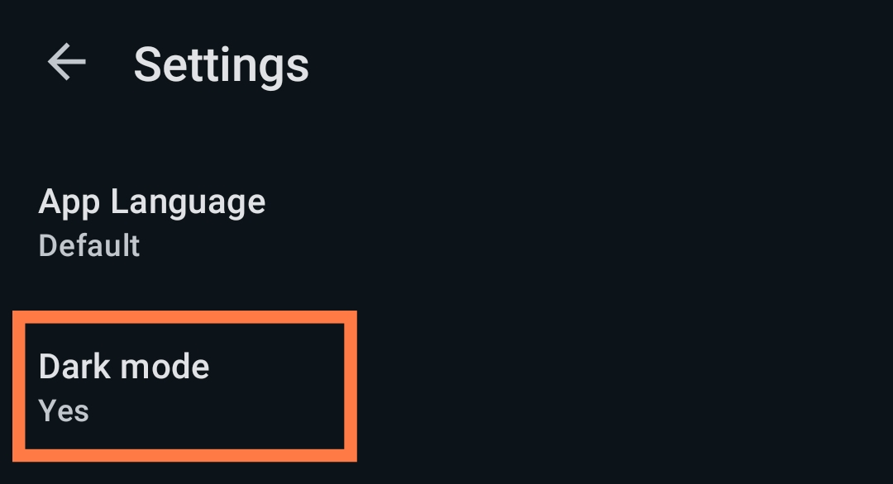

The app will restart in Dark Mode.

## How To Open A Word In DictTango

-- **Long-click** on a Pāḷi word in any PDF, doc or website.

-- After a moment, the **Android menu** will appear.

-- Click on **DictTango** 

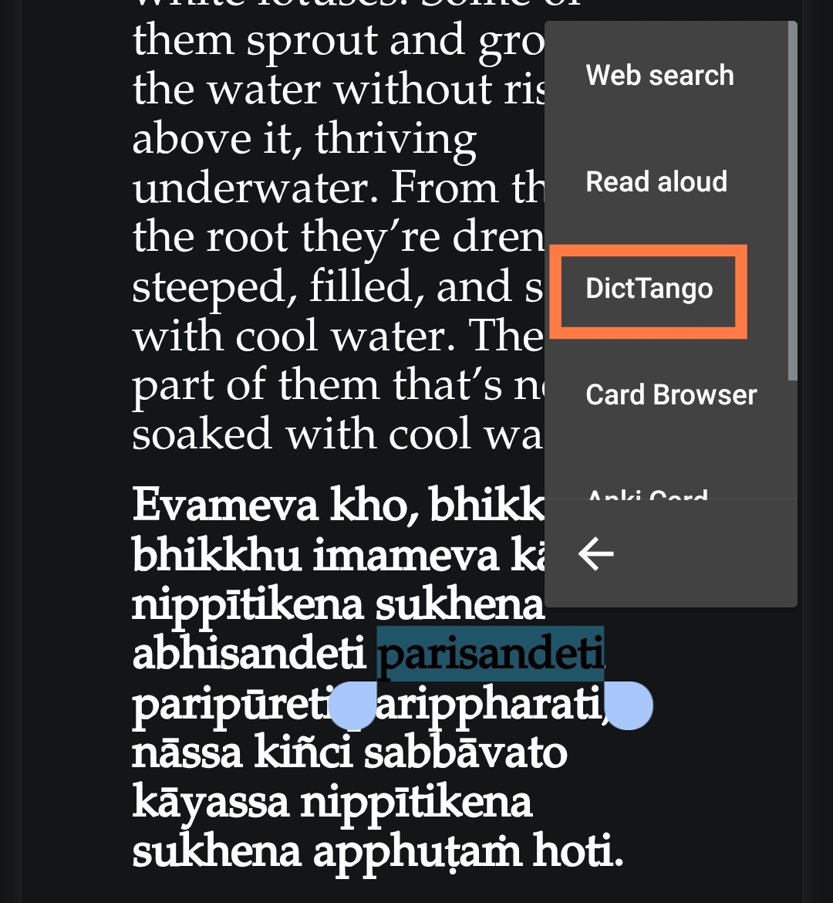

-- All relevant dictionary entries will be displayed 

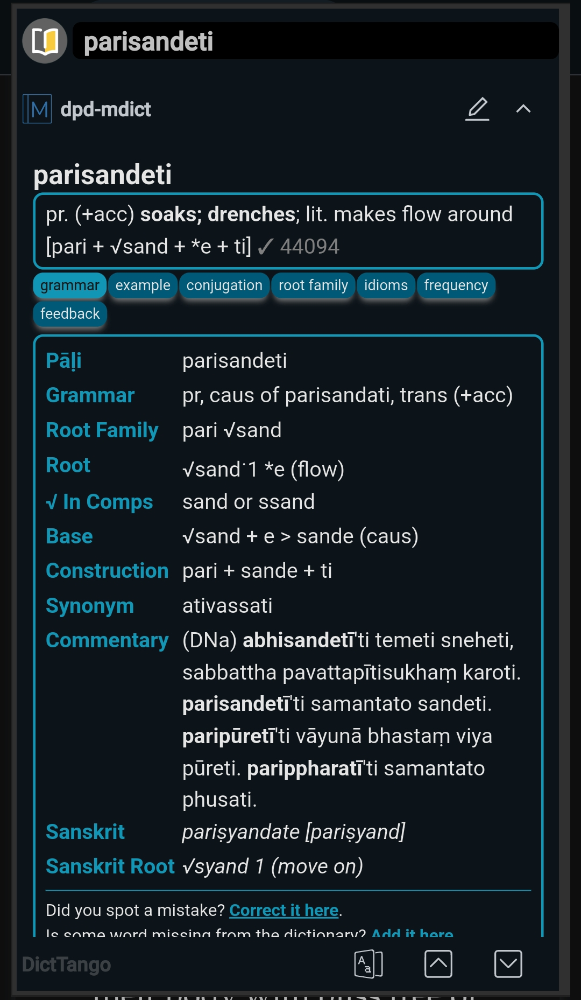

-- Once inside DictTango, just **single-click** on any word to open it. 

## Font Size

To adjust the font size:

-- **Open** any word in the dictionary.

-- **Click on the resize icon** in the bottom right-hand corner.

-- Drag the **slider** up and down to change the font size.

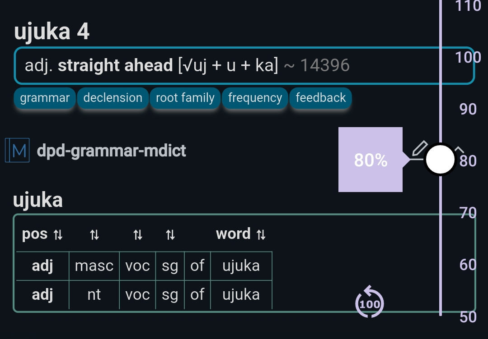

## Install more Pāḷi and Sanskrit dictionaries

Here's a good selection of [Pāḷi and Sanskrit dictionaries](https://github.com/digitalpalidictionary/dpd-db/tree/main/exporter/other_dictionaries){:target="_blank"} in MDict format to install on your Android device.

Enjoy your Pāḷi reading with this great Android app!
